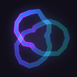

<h1 align="center">Quantum Entanglement</h1>

A Minecraft mod for NeoForge 1.21.1.

Ties up to four item stacks to one shared supply of items. Take from any of
them and every other one loses the same items. It never duplicates and it never
loses anything.

The mod's in-game guide covers everything it adds — hover any of its items and
press <kbd>W</kbd>.

## Installing

Minecraft 1.21.1 and NeoForge 21.1.235 or newer. The same jar goes in `mods` on
both the client and the server. Ponder, which the guide is built on, is bundled
inside; there is nothing else to install.

## Contributing

Issues and pull requests are welcome.

Run `./gradlew runGameTestServer` before opening one. It is 108 in-world game
tests: they start a real server, build real machines and count real items. If
you are changing behaviour, add or adjust a test for it.

Language files come in threes. `en_us`, `ru_ru` and `uk_ua` have to carry the
same keys, and one of those tests enforces it. Translations into further
languages are welcome.

`tools/` holds Python scripts that generate art and generated models — the
logo, the LabPBR specular maps, the core's item model, the sounds. Each one
rebuilds its output from the source beside it, so edit the source and rerun the
script rather than the result.

## Known limitations

Shader packs draw the ritual beams themselves, and some render them white or
not at all. The mod says so in chat once per world when it detects one. Nothing
else is affected.
